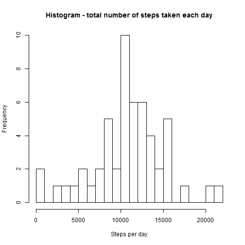
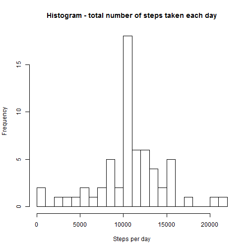

# Reproducible Research: Peer Assessment 1

## Loading and preprocessing the data
Create folder, download data, unzip and make data.table


```r
library(data.table)

url <- "https://d396qusza40orc.cloudfront.net/repdata%2Fdata%2Factivity.zip"
if (!file.exists("RR_proj1")) dir.create("RR_proj1")
if (!file.exists("RR_proj1/data.zip")) download.file(url, destfile = "RR_proj1/data.zip")
if (!file.exists("RR_proj1/activity.csv")) unzip("RR_proj1/data.zip", exdir="RR_proj1")
data <- read.csv("RR_proj1/activity.csv")
my_data <- data.table(data)
```

## What is mean total number of steps taken per day?

1 Total number of steps taken per day


```r
total_steps <- my_data[,.(steps.sum = sum(steps, na.rm=TRUE) )]
total_steps
```

```
##    steps.sum
## 1:    570608
```
  
2 Histogram - total number of steps taken each day

```r
steps_per_day <- my_data[,.(steps.sum = sum(steps)), by = date]
hist(steps_per_day$steps.sum, 
     breaks = 20, 
     main = "Histogram - total number of steps taken each day", 
     xlab = "Steps per day")
```

 

3 Mean and median of the total number of steps taken per day. 


```r
mean(steps_per_day$steps, na.rm=TRUE)
```

```
## [1] 10766.19
```

```r
median(steps_per_day$steps, na.rm=TRUE)
```

```
## [1] 10765
```

## What is the average daily activity pattern?
1 Average number of steps for each 5-minute interval

```r
intervals_mean <- with(my_data,tapply(steps,interval,mean,na.rm=TRUE))
plot(names(intervals_mean),intervals_mean,type="l",xlab="Interval",ylab ="Steps per interval")
```

 

2 Which 5-minute interval, on average across all the days in the dataset, contains the maximum number of steps?

```r
intervals_mean[which(intervals_mean==max(intervals_mean))]
```

```
##      835 
## 206.1698
```

## Imputing missing values

1 The total number of missing values


```r
sum(is.na(my_data$steps))
```

```
## [1] 2304
```

2+3 Strategy for filling in missing values: missing value will be replaced by the mean of that certain 5-minute interval across all days. New data frame is created: my_data_all. It is equal to the original dataset but with the missing data filled in. Mean of each interval is in intervals_mean.


```r
my_data_all <- my_data
my_data_na <- is.na(my_data_all$steps)
my_data_all$steps[my_data_na] <- intervals_mean[as.character(my_data_all$interval[my_data_na])]

head(my_data_all)
```

```
##        steps       date interval
## 1: 1.7169811 2012-10-01        0
## 2: 0.3396226 2012-10-01        5
## 3: 0.1320755 2012-10-01       10
## 4: 0.1509434 2012-10-01       15
## 5: 0.0754717 2012-10-01       20
## 6: 2.0943396 2012-10-01       25
```

4a Histogram of the total number of steps taken each day after filling in missing values

```r
steps_per_day_all <- my_data_all[,.(steps.sum = sum(steps)), by = date]
hist(steps_per_day_all$steps.sum, 
     breaks = 20, 
     main = "Histogram - total number of steps taken each day", 
     xlab = "Steps per day")
```

 

4b Calculate the mean and median total number of steps taken per day after filling in missing values

```r
mean(steps_per_day_all$steps)
```

```
## [1] 10766.19
```

```r
median(steps_per_day_all$steps)
```

```
## [1] 10766.19
```
Mean stays the same as before filling in missing values. Medain changes - now median  is the same as mean because middle intervals have mean values after filling in the missing values.

## Are there differences in activity patterns between weekdays and weekends?

1 A new factor variable is added to the dataset. It has two levels – “weekday” and “weekend” indicating whether a given date is a weekday or weekend day.

```r
my_data_all$day <- weekdays(as.Date(my_data_all$date))

weekend <- with(my_data_all, 
                ifelse( day %in% c("sobota","neděle"),"weekend","weekday"))

my_data_all$day <- factor(weekend)
```

2 Panel plot of 5-minute intervals with the average number of steps averaged across all weekday days or weekend days. First, mean has to be computed.

```r
library(lattice)
intervals_mean_all <- aggregate(steps ~ day+interval, data=my_data_all, FUN=mean)

xyplot(steps ~ interval | factor(day),
       layout = c(1, 2),
       xlab="Interval",
       ylab="Number of steps",
       type="l",
       lty=1,
       data=intervals_mean_all)
```

 
